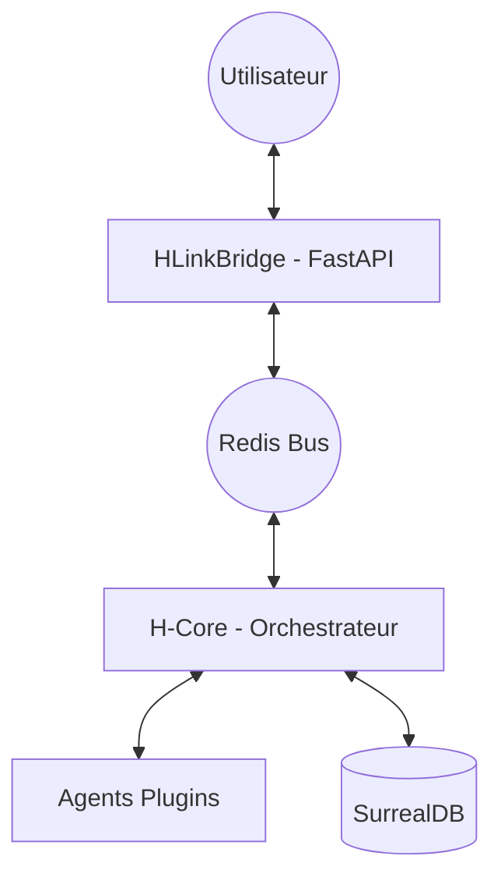

# 11. Refactoring : Découplage du HLinkBridge

Ce document détaille la stratégie de découplage de l'interface WebSocket du noyau cognitif.

## 11.1 Vision Cible

Nous passons d'un monolithe à une architecture à deux services majeurs :

1. **HLinkBridge (Interface)** : Service FastAPI léger gérant l'exposition HTTP/WebSocket.
2. **H-Core (Cerveau)** : Daemon Python pur gérant l'orchestration des agents et la mémoire.

## 11.2 Responsabilités du HLinkBridge (Service A)
- **Static Hosting** : Sert les fichiers de l'A2UI.
- **WebSocket Gateway** : Maintient les connexions avec les navigateurs.
- **Translation** : 
    - Reçoit du JSON via WS -> Publie du `HLinkMessage` sur Redis.
    - Écoute Redis (`broadcast`, `agent:user`) -> Envoie du JSON via WS.
- **API Proxy** : Expose les endpoints `/api/agents` et `/api/history` en interrogeant Redis ou SurrealDB.

## 11.3 Responsabilités du H-Core (Service B)
- **Agent Nursery** : Charge et surveille les plugins d'agents.
- **Cognitive Loop** : Gère le cycle de sommeil et la consolidation.
- **System Health** : Publie périodiquement l'état de santé du système sur Redis.
- **Persistence** : Écoute tous les messages narratifs pour les sauvegarder dans SurrealDB (avec filtrage de confidentialité).

## 11.4 Protocole de Communication (Handshake)
Le Bridge et le Core communiquent via des channels Redis réservés :
- `system:control` : Pour les commandes d'administration (ex: toggle agent).
- `system:status` : Pour le heartbeat et les statistiques en temps réel.

---
*Spécifié par Winston (Architect) le 26 Janvier 2026.*
