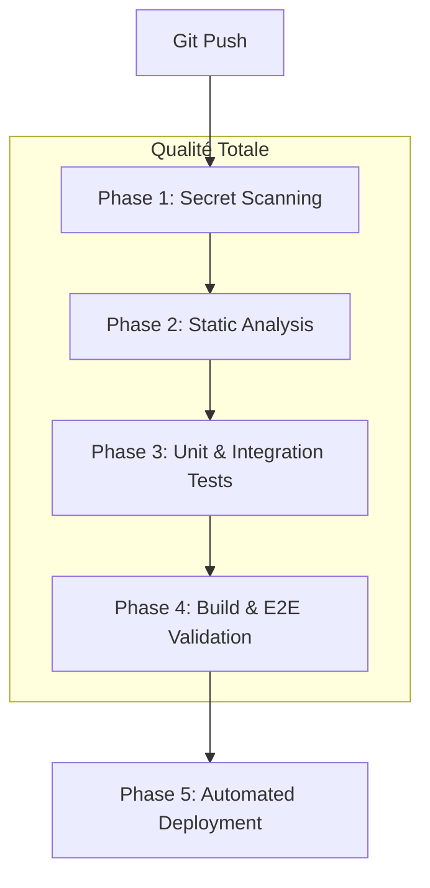

# 12. Design de la Pipeline CI/CD & Sécurité Automatisée

Ce document définit l'implémentation technique de l'usine logicielle hAIrem V3.

## 12.1 Flux de Travail de la Pipeline

La pipeline est découpée en quatre phases séquentielles. Un échec à n'importe quelle phase interrompt immédiatement le processus.

## 12.2 Spécifications des Phases

### Phase 1 : Secret Scanning (Gitleaks)
- **Outil** : [Gitleaks](https://github.com/gitleaks/gitleaks)
- **Objectif** : Empêcher l'introduction de clés API (OpenAI, Gemini, HA) dans le dépôt.
- **Configuration** : Utilisation du mode `protect --staged` en pre-commit ou `detect` en CI.

### Phase 2 : Analyse Statique (Linting)
- **Outils** : `ruff` (Linter ultra-rapide) et `mypy` (Type checking).
- **Cible** : `apps/h-core/src` et `apps/h-bridge/src`.

### Phase 3 : Tests de Régression
- **Outil** : `pytest`
- **Exécution** : Lancement de la suite complète (47+ tests) dans un environnement Python isolé.

### Phase 4 : Build & E2E
- **Action 1** : `docker compose build` pour vérifier que les Dockerfiles sont valides.
- **Action 2** : Lancement de `scripts/master_regression_v3.py` pour valider le flux H-Link réel.

### Phase 5 : Déploiement (Docker)
- **Méthode** : Déclenchement d'un script `scripts/deploy.sh` qui :
    1. Effectue un `git pull`.
    2. Lance `docker compose up -d --build`.
    3. Vérifie le `system.heartbeat` après 10 secondes.

## 12.3 Outillage CI (Runner)
Pour ce projet, nous privilégierons **GitHub Actions** pour sa simplicité d'intégration, mais la logique sera encapsulée dans un script `scripts/ci_run.sh` pour permettre une exécution locale identique à la CI.

---
*Spécifié par Winston (Architect) le 26 Janvier 2026.*
