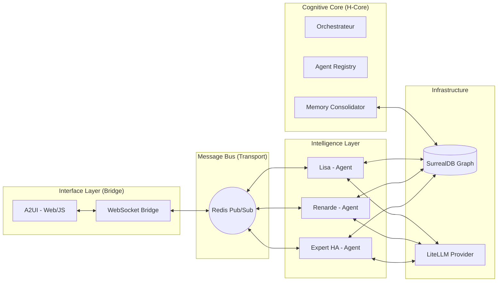

# 2. Architecture de Haut Niveau (V3)

hAIrem est conçu comme un écosystème multi-agents asynchrone orchestré par un bus de données haute performance.

## 2.1 Schéma Global (Macro-Architecture)

## 2.2 Principes de Séparation des Responsabilités

### A. Le Bridge (FastAPI/WebSockets)
Son rôle est purement transactionnel : transformer les messages Web (JSON) en messages H-Link (Redis) et inversement. Il ne doit contenir aucune logique métier ou cognitive.

### B. Le Bus (Redis)
Le système nerveux. Tout message (texte, commande, log, changement d'humeur) circule sur des channels dédiés (`agent:name`, `broadcast`).

### C. Le Core & Nursery
L'Orchestrateur gère le cycle de vie des agents (Hot-reload via `PluginLoader`) et les services de fond (Health checks, Memory consolidation).

### D. Les Agents
Des entités autonomes héritant de `BaseAgent`. Ils sont responsables de leur propre "pensée" (LLM) et de l'utilisation de leurs outils (HA, Memory Search).

## 2.3 Flux de Données Type

1. **Input :** L'utilisateur envoie un message via A2UI.
2. **Routing :** Le Bridge publie sur le channel `agent:target`.
3. **Inference :** L'agent cible reçoit le message, consulte sa **Mémoire Subjective** (SurrealDB), appelle le LLM.
4. **Action :** Si besoin, l'agent publie une `expert.command` pour piloter la maison.
5. **Output :** L'agent publie sa réponse `narrative.text` sur le channel `broadcast`.
6. **Feedback :** Le Bridge retransmet au WebSocket, le Renderer A2UI met à jour le Stage.

---
