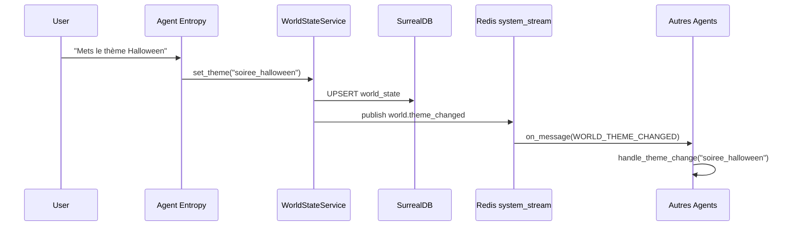

# Architecture Design: Gestion de l'État du Monde (World State — Sprint 22)

**Version:** 1.0
**Status:** Implémenté
**Author:** Winston (Architect)
**Date:** 2026-02-22

---

## 1. Introduction

L'état global du monde (*World State*) permet de modifier l'ambiance de la maison en cascade : thème visuel, comportement des agents, et contexte narratif. Ce système a été implémenté en Sprint 22 avec le `WorldStateService`, l'intégration dans l'agent Entropy, et la réception côté `BaseAgent`.

---

## 2. WorldStateService

**Fichier :** `src/services/spatial/world_state.py`

Service central de gestion du thème mondial. Maintient l'état courant en mémoire et le persiste dans SurrealDB.

```python
class WorldStateService:
    def __init__(self, surreal_client, redis_client): ...
    async def set_theme(self, theme_name: str) -> None: ...
    def get_theme(self) -> str: ...
```

### 2.1 Persistance SurrealDB

À chaque `set_theme()`, une requête UPSERT est exécutée sur la table `world_state` :

```sql
UPDATE world_state SET theme = $theme WHERE id = "current";
```

Si `surreal_client` est `None` (mode test ou infra dégradée), la persistance est ignorée silencieusement. L'état reste disponible en mémoire.

### 2.2 Événement de Cascade Redis

Après mise à jour, un événement est publié sur `system_stream` :

```json
{
  "type": "world.theme_changed",
  "sender": {"agent_id": "entropy", "role": "system"},
  "payload": {
    "content": {
      "theme": "soiree_halloween"
    }
  }
}
```

Tous les composants abonnés à `system_stream` reçoivent cet événement et adaptent leur comportement.

---

## 3. Flux de Changement de Thème



---

## 4. Intégration dans l'Agent Entropy

**Fichier :** `agents/entropy/logic.py`

L'agent Entropy est le seul autorisé à modifier le World State. Il expose le skill `change_world_theme` déclaré dans `agents/entropy/persona.yaml`.

```yaml
skills:
  - name: change_world_theme
    description: "Change le thème global du monde (ex: Christmas, Cyberpunk, Beach)."
```

Ordre d'initialisation dans `setup()` :

```python
def setup(self):
    from src.services.spatial.world_state import WorldStateService
    self.world_state = WorldStateService(self.surreal, self.redis)
    super().setup()
```

`WorldStateService` doit être créé **avant** `super().setup()` pour que `_load_dynamic_skills()` trouve la méthode `change_world_theme` opérationnelle lors de l'enregistrement des skills.

Méthode exposée :

```python
async def change_world_theme(self, theme_name: str) -> str:
    await self.world_state.set_theme(theme_name)
    return f"Thème du monde changé en '{theme_name}'."
```

---

## 5. Réception dans BaseAgent

**Fichier :** `src/domain/agent.py` — méthode `on_message()`

`BaseAgent` gère deux types de messages déclenchant la mise à jour du thème :

| Type de message | Condition | Action |
|-----------------|-----------|--------|
| `WORLD_THEME_CHANGED` | `payload.content["theme"]` présent | `handle_theme_change(theme)` |
| `SYSTEM_STATUS_UPDATE` | `payload["event"] == "world_theme_change"` | `handle_theme_change(payload["theme"])` |

---

## 6. SpatialManager & Badge de Présence

**Répertoire :** `src/services/spatial/`

Le `SpatialManager` gère la présence physique des agents dans les différentes pièces. Un heartbeat est émis périodiquement pour maintenir le badge de présence de chaque agent à jour sur l'interface.

Les données de présence sont stockées dans SurrealDB (`location`, `agent_presence`) et mises à jour à chaque tick du badge spatial.

---

## 7. Thèmes Disponibles

Les thèmes sont des chaînes libres. Exemples utilisés dans les tests et la documentation :

| Thème | Description |
|-------|-------------|
| `Default` | Thème neutre par défaut |
| `Christmas` | Ambiance festive de Noël |
| `Cyberpunk` | Esthétique néon futuriste |
| `Beach` | Ambiance estivale |
| `soiree_halloween` | Soirée Halloween |
| `winter_night` | Nuit d'hiver |

La liste n'est pas exhaustive — tout thème peut être défini librement via la commande vocale ou l'API.
