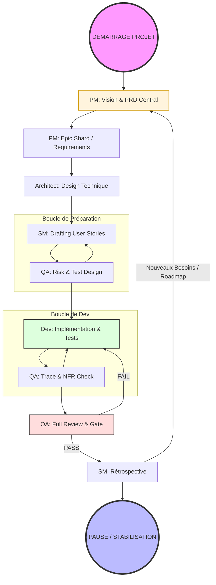

# Organisation de l'Équipe & Flux de Travail hAIrem (BMad™)

Ce document définit les rôles et le cycle de vie d'une fonctionnalité au sein du projet hAIrem.

## 1. Les Rôles (Personas)

| Rôle | Persona | Responsabilité Principale | Document de Référence |
| :--- | :--- | :--- | :--- |
| **Product Manager (PM)** | **John** | Définit le "Quoi" et le "Pourquoi". Vision, Roadmap, Priorisation. | `docs/prd.md`, `docs/prd/epic-*.md` |
| **Architect** | **Léonard** | Définit le "Comment" technique global. Design système, patterns, stack. | `docs/architecture.md`, `docs/architecture/*.md` |
| **Scrum Master (SM)** | **Bob** | Prépare les Stories détaillées pour les Devs. Gère le backlog et les sprints. | `docs/stories/*.md` |
| **Developer** | **James** | Implémente le code et les tests unitaires. | Codebase (`apps/`, `packages/`) |
| **Test Architect (QA)** | **Quinn** | Valide la qualité, les risques et la conformité. | `docs/qa/`, QA Gates |

---

## 2. Le Flux de Travail Nominal (The "Happy Path")

### Phase A : Définition (PM + Architecte)
1. **PM (John) :** Met à jour le **PRD Central** (`docs/prd.md`) avec une nouvelle vision ou de grands piliers.
2. **PM (John) :** Découpe le PRD en **Epic Shards** (`docs/prd/epic-X-name.md`) pour détailler les exigences métier de chaque grand bloc.
3. **Architecte :** Met à jour la **Documentation d'Architecture** pour refléter les nouveaux patterns nécessaires (ex: schéma de base de données, nouveaux protocoles).

### Phase B : Préparation (Scrum Master)
4. **SM (Bob) :** Prend un Epic Shard du PM et génère les **User Stories** (`docs/stories/X.Y-name.md`).
5. **SM (Bob) :** Détaille les critères d'acceptation (AC) pour qu'un développeur (même une IA "bête") puisse exécuter sans ambiguïté.

### Phase C : Assurance Qualité Initiale (QA)
6. **QA (Quinn) :** Analyse les risques (`*risk`) et définit la stratégie de test (`*design`) pour la story **avant** que le dev ne commence.

### Phase D : Implémentation (Dev)
7. **Dev (James) :** Implémente la fonctionnalité et ses tests. Il suit scrupuleusement les AC de la story.
8. **Dev (James) :** Effectue ses propres vérifications (lint, tests locaux).

### Phase E : Validation (QA)
9. **QA (Quinn) :** Effectue la revue finale (`*review`). Il vérifie la traçabilité (`*trace`) et les exigences non-fonctionnelles (`*nfr`).
10. **QA (Quinn) :** Signe la **QA Gate** (PASS/FAIL).

### Phase F : Clôture
11. **SM (Bob) :** Anime la **Rétrospective** une fois l'Epic terminé.

---

## 3. Outillage & Capacités Avancées

Grâce au framework BMad et aux extensions Gemini CLI, chaque rôle dispose de capacités augmentées ("Super-pouvoirs") qu'il est encouragé à utiliser.

| Rôle | Outil Spécifique | Usage Autorisé |
| :--- | :--- | :--- |
| **QA (Quinn)** | **MCP Playwright** | Navigation Web réelle pour valider les interfaces (H-Bridge), simuler des interactions utilisateur et exécuter des scénarios E2E complexes. |
| **Dev (James)** | **MCP Playwright** | Debugging d'interface, validation visuelle rapide avant commit. |
| **Dev (James)** | **Github Tool** | Consultation des Issues/PR, et préparation des commandes git avancées. |
| **Arch / Dev** | **Context7** | Recherche documentaire technique de premier niveau (Docs officielles Python, FastAPI, SurrealDB) via `resolve-library-id` pour éviter les hallucinations. |
| **Tous** | **Beads (bd)** | Mémoire persistante des tâches et blocages (si activé sur le projet). |

---

## 4. Erreurs Communes à Éviter
- **Sauter le PM :** Créer des stories sans avoir un Epic Shard dans `docs/prd/`. On perd le "Pourquoi".
- **Sauter l'Architecte :** Implémenter une feature complexe sans mettre à jour l'architecture. On crée de la dette technique.
- **Sauter la QA :** Valider soi-même sans passer par Quinn. On risque des régressions.
- **Confondre Story et Sprint :** Une Story est une unité de valeur. Un Sprint est un bloc de temps (ou un groupe de stories).

---
*Document généré par John (PM) le 26 Janvier 2026.*
